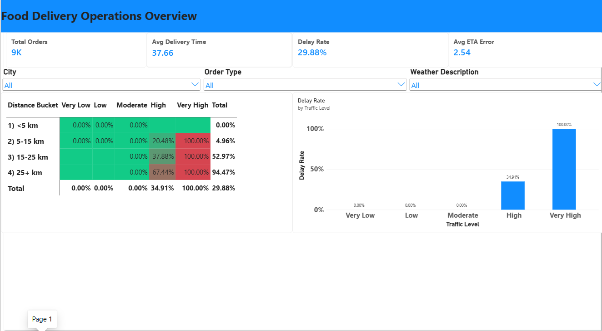
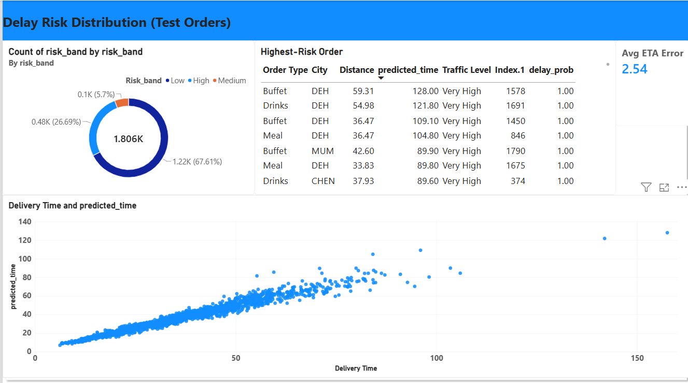
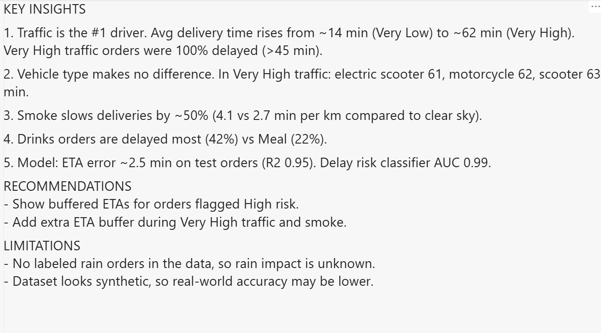

# Food Delivery ETA Prediction & Analytics

End-to-end project on Indian food-delivery orders: clean the data, explore delay patterns, query it with SQL, predict **delivery time (ETA)** and **delay risk** with machine learning, and present the findings in a Power BI dashboard.

**Tools:** Python (pandas, scikit-learn), SQL (SQLite), Power BI

## Problem
For every order, a delivery platform needs to answer two questions:
1. How many minutes will the delivery take? (**regression**)
2. Will it be delayed (more than 45 minutes)? (**classification**)

## Dataset
Food Delivery Dataset from India for Delivery Time Prediction (Zenodo, DOI 10.5281/zenodo.18370027).
10,001 raw rows and 17 columns (delivery person, locations, order type, vehicle, weather, traffic level, distance, delivery time).
After cleaning, **9,026 labeled orders** were used. The raw file is not included in this repo; download it from Zenodo.

## Approach
1. **Cleaning:** removed blank row and duplicate IDs, trimmed text, extracted city from delivery-person ID, set invalid ratings (>5), ages (<18) and bad coordinates to missing, removed 916 unlabeled rows and 1 impossible-speed row.
2. **EDA:** distribution of delivery time, traffic / vehicle / weather / city effects, correlations.
3. **Feature engineering:** traffic score (1-5), distance x traffic, short-trip flag, grouped weather and city, delay flag (>45 min, 29.9% of orders).
4. **SQL analytics:** KPIs, delay by traffic, city ranking (window function), distance x traffic buckets (CTE), weather comparison. See `sql/queries.sql`.
5. **Machine learning:** 3 regression and 3 classification models, 80/20 split.
6. **Dashboard:** 2-page Power BI report plus an insights page.

## Results (test set, 1,806 orders)

**ETA prediction (regression)**

| Model | MAE (min) | RMSE | R2 |
|---|---|---|---|
| Linear Regression | 3.31 | 4.74 | 0.918 |
| Random Forest | 2.59 | 3.73 | 0.949 |
| **HistGradientBoosting** | **2.51** | **3.67** | **0.951** |

**Delay risk (classification, delay = more than 45 min)**

| Model | ROC-AUC | Precision (delayed) | Recall (delayed) |
|---|---|---|---|
| Logistic Regression | 0.989 | 0.857 | 0.954 |
| Random Forest | 0.989 | 0.897 | 0.931 |
| **HistGradientBoosting** | **0.990** | **0.930** | **0.913** |

Traffic level is by far the most important feature (permutation importance 0.286 vs 0.021 for the next feature).

## Key insights
- **Traffic is the main driver of delay.** Median delivery time rises from about 14 min (Very Low traffic) to about 62 min (Very High). In this dataset every Very High traffic order was delayed (>45 min), while Moderate or lower traffic had none.
- **Vehicle type makes no visible difference.** Under Very High traffic: electric scooter 61, motorcycle 62, scooter 63 min.
- **Smoke slows deliveries by about 50%** (4.11 vs 2.74 min per km for clear sky), even though smoke orders were shorter.
- **Drinks orders are delayed most (42%)**, Meal least (22%), at similar distances.
- **City matters:** Mumbai (3.80 min/km) and Chennai (3.73) are slowest, Agra (2.45) and Vadodara (2.51) fastest. Smaller cities have only about 100-175 orders.
- **Recommendation:** show a buffered ETA for orders flagged high risk, and add extra buffer during Very High traffic and smoke.

## Dashboard




## Limitations
- **No labeled rain data:** all 536 "light rain" orders had missing delivery time, so the model cannot say anything about rain.
- The dataset looks **synthetic** (for example, fixed offsets between restaurant and delivery coordinates), so real-world accuracy would likely be lower than the numbers above.
- The model **underestimates very long deliveries** (over 100 min).
- Delay risk is largely a function of traffic level, which explains the very high classifier scores.
- No date/time column, so hour-of-day and day-of-week effects could not be studied.
- Some cities and the bicycle vehicle type have very few orders.

## Repository structure
```
food-delivery-eta-prediction/
|-- README.md
|-- requirements.txt
|-- notebooks/    Colab notebook (.ipynb)
|-- data/         clean_food_delivery.csv, featured_food_delivery.csv, powerbi_predictions.csv
|-- sql/          queries.sql
|-- models/       eta_model.pkl, delay_model.pkl
`-- powerbi/      dashboard (.pbix) and screenshots
```

## How to run
1. Download `foodtimedataset.xlsx` from Zenodo.
2. Open the notebook in Google Colab, upload the file, run all cells.
3. Open the `.pbix` in Power BI Desktop (or load the CSVs from `data/`).
